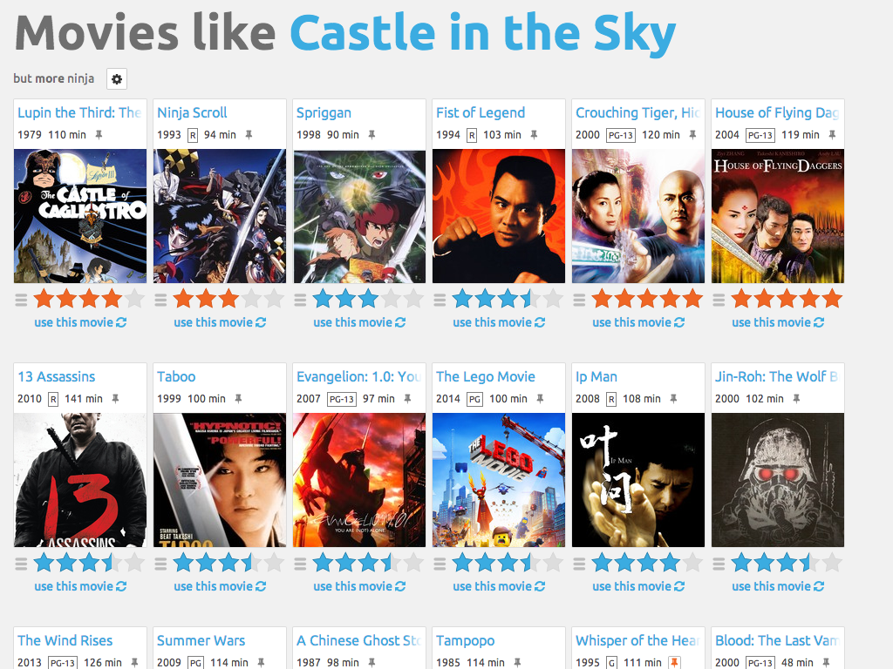
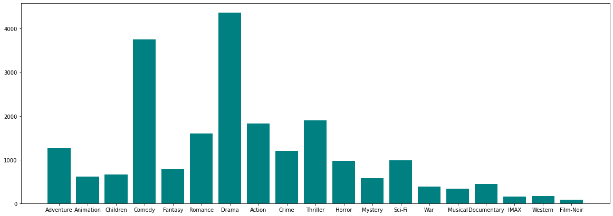

# Movie-Lens-Recommender

## Introduction
When you decide that you want to watch a movie there are an overwhelming number of movies to pick from. This causes a problem, which movie should you watch? Well for a while now there has been a program that companies like Netflix and Hulu that have a solution. It is called a recommendation system or recommendation engine. What they do is they take in what you rate the movies you watched and try to match up other movies that are relevant to those movies so you can enjoy bingeing what you love.

# Data:
I am using the data from Movie Lens 100k, which houses 1000 different titles of movies and a bit over 100K ratings for those movies.
## Download:
https://files.grouplens.org/datasets/movielens/ml-latest-small.zip

# Notebook details:
The program will ask what the users favorite genre is and will ask them to rate a random generated list of 25 movies in that category and display results of what it would suggest you to watch based off of other users that liked those movies.

As you can see above there are a total of 19 different genre categories, but that doesn't mean that each movie is just in a single category. There is some definite overlap, just take a look at the bottom photo. Finally the below photo is also what is generated after we take in the users ratings.

# Conclusion:
Thank you for your time!
