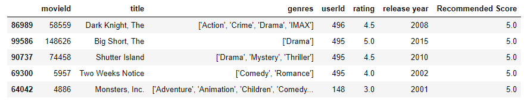

# Movie-Lens-Recommender

## Introduction
When you decide that you want to watch a movie there are an overwhelming number of movies to pick from. This causes a problem, which movie should you watch? Well for a while now there has been a program that companies like Netflix and Hulu that have a solution. It is called a recommendation system or recommendation engine. What they do is they take in what you rate the movies you watched and try to match up other movies that are relevant to those movies so you can enjoy bingeing what you love.

# Data:
I am using the data from Movie Lens 100k, which houses 1000 different titles of movies and a bit over 100K ratings for those movies.
## Download:
https://files.grouplens.org/datasets/movielens/ml-latest-small.zip

# Notebook details:
The program will ask what the users favorite genre is and will ask them to rate a random generated list of 25 movies in that category and display results of what it would suggest you to watch based off of other users that liked those movies.

As you can see above there are a total of 19 different genre categories, but that doesn't mean that each movie is just in a single category. There is some definite overlap, just take a look at the bottom photo. Finally the below photo is also what is generated after we take in the users ratings.

# Conclusion:
Since this is a simple recommender system, there are some limitations to it. One of the major flaws to it is that if a user rating items has not supplied enough ratings then the system defaults to the mean of all the ratings which is something that can be done in future updates. you can always set up the recommender to take the first 25 or more ratings from the user to also suppliment that instead of updating it in other means. Another limitation that I have seen is that I have seen is the last release year to the movies is 2018, which means there is a whole 3 years of movies and ratings that we don't have access to so updated data is always a good thing to have. also with the release years it has alot of movies that are from before 1990 that are not heard of really so a great thing to have would be a picture of the movies to show what it looks like which is a good future works.
